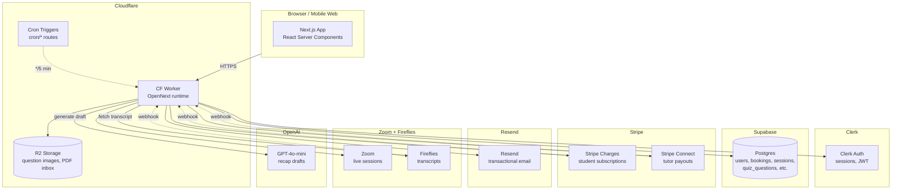

# Architecture

A high-level map of how Karman Prep's pieces fit together. New devs read this once, then dive into the code.

## System overview



## Roles

Four user roles, each gated at `/<area>/layout.tsx` via `requireRole()`:

| Role        | URL prefix                                       | Can do                                                       |
| ----------- | ------------------------------------------------ | ------------------------------------------------------------ |
| **Student** | `/dashboard/student/`, `/learn/`, `/diagnostic/` | Take quizzes, see progress, manage their account             |
| **Tutor**   | `/tutor/`                                        | View their cohorts/students, send recaps, request payouts    |
| **Parent**  | `/dashboard/parent/`                             | View their linked students' progress + billing               |
| **Admin**   | `/admin/`                                        | Everything — curriculum, question bank, jobs, users, revenue |

## Key flows

### 1. Student takes a quiz

```
Student → /learn/<subject>/<nodeId>
  → server fetches questions filtered by adaptive engine
  → renders <QuizEngine> client component
  → student answers
  → quiz_attempts row created with adaptive_path
  → question_responses inserted per answer
  → confidence_band updated on learn_node_status
```

### 2. Tutor sends a session recap (the "recaps + payouts" pipeline)

```
Live Zoom session ends
  → Fireflies records + transcribes
  → Fireflies webhook → /api/webhooks/fireflies-transcript
  → Match Zoom meeting_id → bookings → sessions
  → Save transcript on the session row
  → Call OpenAI: generateStatusDraft(transcript, sessionType)
    - "individual" → personalized to one student
    - "group"      → no names, focus on session content
  → Save draft to sessions.status_draft
  → Insert notification: "Draft ready for tutor"
Tutor opens /tutor/sessions/<id>/status-draft
  → Reviews + edits the 8 fields
  → Clicks "Send recap & mark for payout"
  → actionSendRecap:
    - Resolve recipients (student email + parents via parent_student_links)
    - Send ONE email via Resend (group recap = single email to all enrolled)
    - Update sessions.recap_email_sent = true, payout_status = 'pending', payout_amount
    - Insert status_email_log audit row
```

### 3. Tutor requests a payout

```
Tutor visits /tutor/payouts
  → Server fetches sessions where payout_status = 'pending'
  → Renders Instant + ACH buttons (Instant gated on debit-card eligibility)
Tutor clicks "Get paid via ACH" or "Get paid instantly"
  → actionRequestPayout(method):
    - Sum eligible sessions' payout_amount
    - Apply 2.5% app fee for instant; 0% for ACH
    - Insert payout_requests row (status='pending_approval')
    - Mark sessions payout_status='requested'
    - Stripe Transfer: KarmanPrep → tutor's Connect account
    - Stripe Payout: Connect account → bank/card
    - Mark sessions payout_status='paid'
    - Send confirmation email
```

### 4. Admin imports SAT questions

```
Admin runs PDF through Custom GPT (see ADR 0003)
  → Downloads CSV
  → Uploads at /admin/questions/import
  → bulkImportRows() validates each row:
    - concept_slug must exist in 89-slug taxonomy
    - domain must be valid
    - Image-bearing rows auto-flagged for review
  → Inserts quiz_questions + answer_choices
  → R2 receives any inline-base64 images
  → Admin reviews flagged rows at /admin/questions/review
```

## Data model — core tables

| Table                                  | Role                                                     | Notes                                                              |
| -------------------------------------- | -------------------------------------------------------- | ------------------------------------------------------------------ |
| `users`                                | Single source for all roles (student/tutor/parent/admin) | `clerk_id` is the join key from Clerk                              |
| `bookings`                             | Per-student-per-session enrollment row                   | `session_id` FK to `sessions`; Stripe charges per booking          |
| `sessions`                             | The actual class meeting                                 | Tutor pay + recap state lives here (see ADR 0001)                  |
| `cohorts` + `cohort_members`           | Group-class membership                                   | `tier` ∈ `small_group` (≤5) / `group` (≤250)                       |
| `quiz_questions` + `answer_choices`    | Question bank                                            | Filtered by `concept_slug` from the 89-slug taxonomy               |
| `quiz_attempts` + `question_responses` | Student quiz history                                     | Drives confidence-band scoring                                     |
| `learn_node_status`                    | Per-student, per-concept progress                        | `mastered` / `available` / `locked`                                |
| `payout_requests`                      | Tutor-initiated batch payouts                            | `session_ids[]` FK array; Stripe transfer + payout IDs stored here |
| `status_email_log`                     | Audit log of recap emails                                | One row per send, links to Resend message ID                       |
| `webhook_events`                       | Inbound webhook archive + dedup                          | Source-keyed unique index on `external_event_id`                   |
| `parent_student_links`                 | Many-to-many parent ↔ student                            | Used to resolve email recipients for recap sends                   |

## Where everything lives in code

```
src/
├── app/
│   ├── (admin)         /admin/* — internal tooling
│   ├── (auth)          /auth/sign-in, sign-up
│   ├── (dashboard)     /dashboard/student, /dashboard/parent
│   ├── (learn)         /learn, /diagnostic, /practice
│   ├── (tutor)         /tutor, /tutor/payouts, /tutor/earnings, /tutor/sessions/[id]
│   └── api/            REST endpoints + webhooks
├── components/         shared React UI
├── lib/
│   ├── integrations/   3rd-party API wrappers (cal/fireflies/openai/resend/slack/stripe/zoom)
│   ├── supabase/       DB client + queries (one file per area)
│   ├── payouts/        compute-amount.ts (15-min rounding)
│   ├── question-bank/  bulk-import + taxonomy
│   ├── chat/           cohort + DM logic (deferred — Slack chat paused)
│   └── ...
├── data/curriculum.ts  89 concept slugs (the source of truth for taxonomy validators)
├── emails/             React Email templates
└── proxy.ts            Clerk auth gate (was middleware.ts before Next.js 16 deprecated that filename)
```

## External services + what they cost

| Service            | Cost                                                          | What it does                             |
| ------------------ | ------------------------------------------------------------- | ---------------------------------------- |
| Cloudflare Workers | $0–$5/mo (free tier covers most use)                          | App runtime + R2 storage + Cron Triggers |
| Supabase           | $0 (free tier; $25/mo Pro when team grows)                    | Postgres + storage                       |
| Clerk              | $0 (free up to 10K MAU)                                       | Auth + sessions                          |
| Stripe             | per-transaction (Charges 2.9% + $0.30; Connect ~$0.25/payout) | Student subscriptions + tutor payouts    |
| Resend             | $0 (free up to 3K emails/mo)                                  | Transactional email                      |
| Zoom               | $0–$15/mo per host                                            | Live sessions                            |
| Fireflies          | $0 (free tier) or $19/mo Pro                                  | Transcripts                              |
| OpenAI             | ~$0.001 per recap                                             | Recap drafting                           |
| ChatGPT Plus       | $20/mo                                                        | Custom GPT for question imports          |
| GitHub Free        | $0 (no branch protection on private repos — see CONTRIBUTING) | Hosting + CI                             |
| Sentry             | $0 (free tier)                                                | Error tracking                           |

## Where to dig deeper

- **Why we chose X**: [`docs/adr/`](./adr/)
- **Specific subsystem**: [`docs/ingestion/`](./ingestion/) (question imports), [`docs/recaps-payouts/`](./recaps-payouts/) (recap-payout audit)
- **Operations**: [`docs/deployment-cloudflare.md`](./deployment-cloudflare.md), [`docs/handoff.md`](./handoff.md)
- **Code conventions**: [`CONTRIBUTING.md`](../CONTRIBUTING.md)
